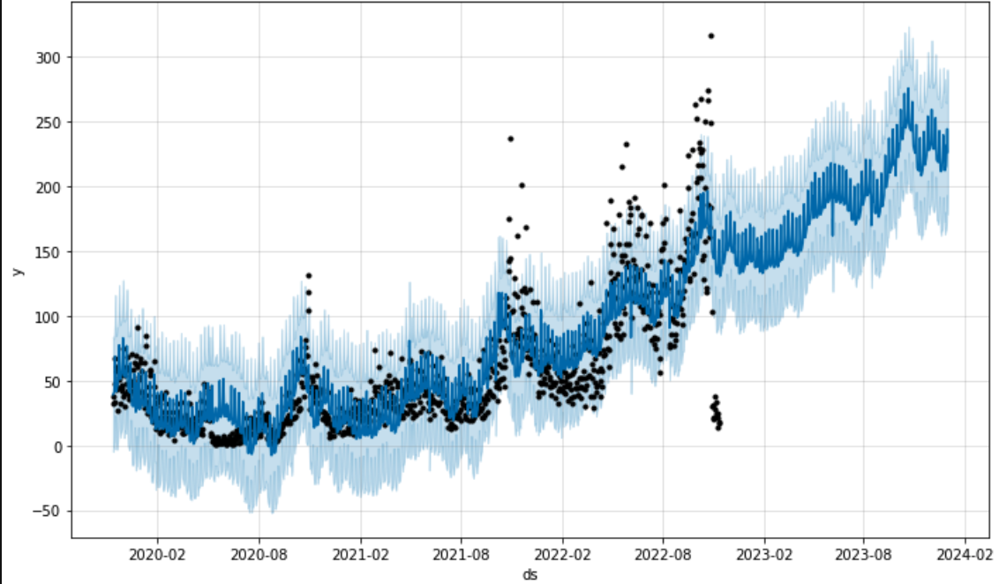
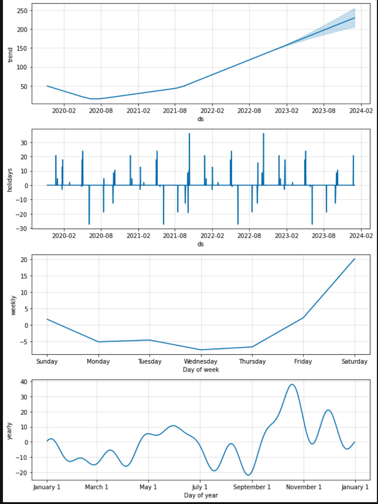
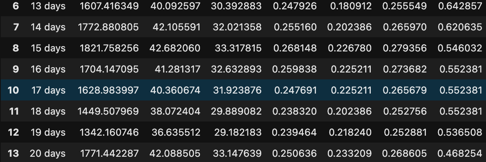

<p>시간 데이터와 y값만 있으면 비개발자여도 시계열 데이터를 예측 할수 있도록 페이스북에서 공개한 오픈 라이브러이다. 
정확도가 높고 예측에 사용되는 항목을 볼수 있으며 cross-validation을 통해 검증할수 있게 구현되어 있다.</p>

공식 
  y(t) = g(t) + s(t) + h(t) + 오차

 구성요소 
- Growth(g(t))
  - linear Growth
  - logistic Growth : 상한, 하한 값 있음 
  - 피팅 파라메터 
    - changepoint_range(0~1) : 기본으로 prophet이 자동감지 하여 트랜드가 변화되지만 좀더 트랜디한 모델로 학습하기 위해 설정. 전체 데이터중에 cp가 발생 할수 있는 데이터 비율 
    - changepoint_prior_scale(0~1) : cp가 발생하는 빈도를 조정, 값이 클수록 빈번하게 cp발생함으로 overfitting이 발생할 수 있다
    - changepoints : 특정일을 changepoint로 지정
- Seasonality(s(t))
  - 년, 주, 일 단위 Seasonality 설정 
  - 피팅 파라메터
    - yearly_seasonallity : default = auto , true로 세팅
    - seasonality_prior_scale: 
    - seasonality_mod : addtive, multiplicative 계정성을 트랜디와 합으로 할지 곱으로 할지 설정  
      ```python
      m = Prophet(yearly_seasonality = True
      weekly_seasonality = True
      ```
- Holidays(h(t))
  - 피팅 파라메터 
    - holidays_prior_scale = hoilday의 영향도를 조정. 클수도 휴일의 영향이 크다. 
  - 내장된 휴일정보 사용
    ```python
       m.add_country_holidays(country_name='KR')
    ```
  - 사용자 지정 휴일 정보 사용 
    ```python
    # 공휴일 적용
    holiday_df = pd.read_csv("holidays.csv")[['시작일']]
    
    holidays = pd.DataFrame({
    
    'holiday': 'kr_holidays',
    
    'ds': pd.to_datetime(holiday_df['시작일'].tolist()),
    
    'lower_window': -1,
    
    'upper_window': 1
    
    })
  
    m = Prophet(holidays=holidays)
    ```
  

모델 생성 
```python
m = Prophet(growth='logistic'
            , yearly_seasonality = True
            , weekly_seasonality = True
            , interval_width=0.90
            , holidays=holidays
            , holidays_prior_scale = 10
            , seasonality_prior_scale = 0.01
           )
m.add_country_holidays(country_name='KR')
m.fit(train_data)
```
예측 예시



모델 피처 영향도 파악
```python
fig2 = m.plot_components(df_fc_temp)
```
피쳐별 영향도 예시



모델 검증
```python
df_p = performance_metrics(df_cv)
```
모델 예측 일자별 오류값 예시 

 